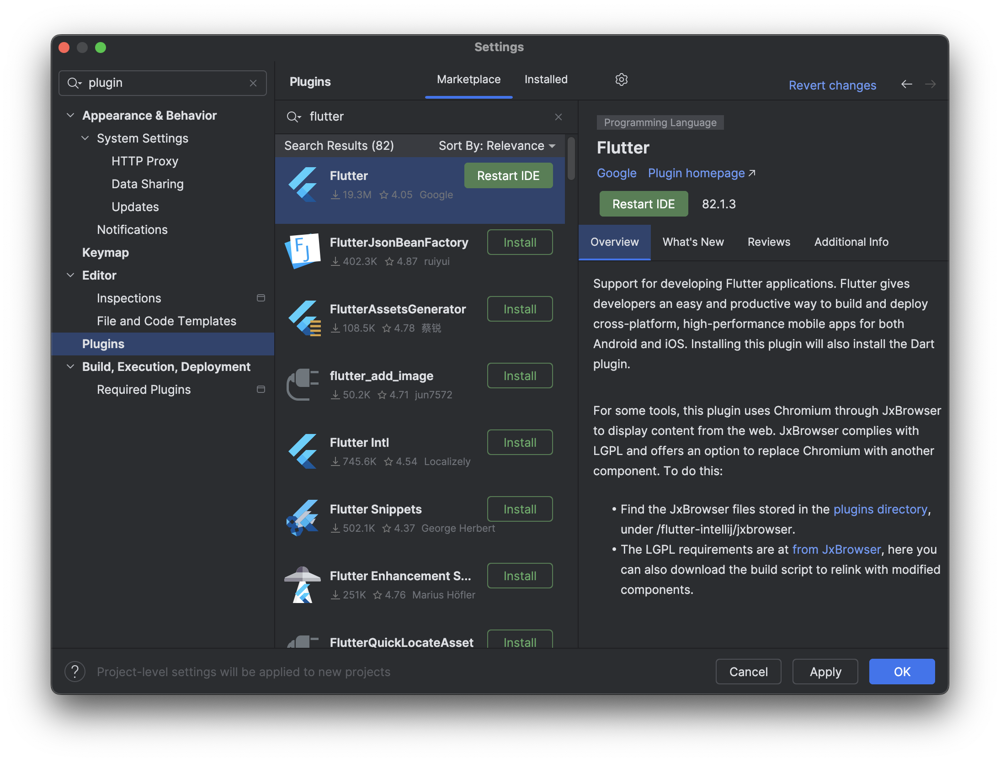
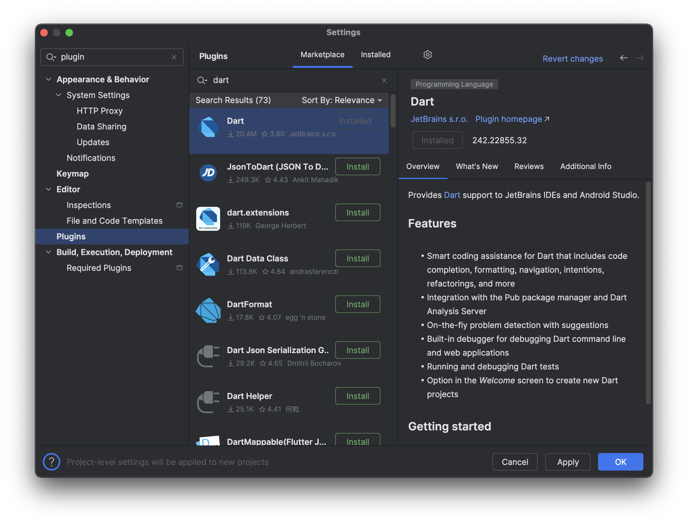
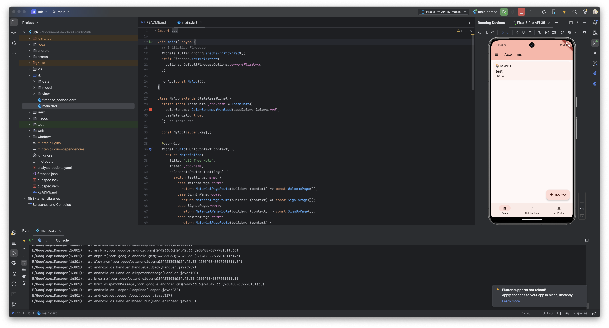

# USC Tree Hole

An app that brings Trojans together and share their life.

## How to Run

#### How to Build a Release APK

Simply go under the project directory and execute `flutter build apk --split-per-abi`, the output apk will be generated under the directory of `/build/app/outputs/apk/release/`.

#### How to Run the App in Debug Environment

1. Install Dart and Flutter plugin in your Android Studio.

2. Clone the Project to local by using Get from VCS in Android Studio, it will automatically pull the project to local.
3. Run the Project on the Device you want!

Improved functionalities:
- users can now reset password by sending out email to them with link to reset password
- users can now sort posts by either create time or title.